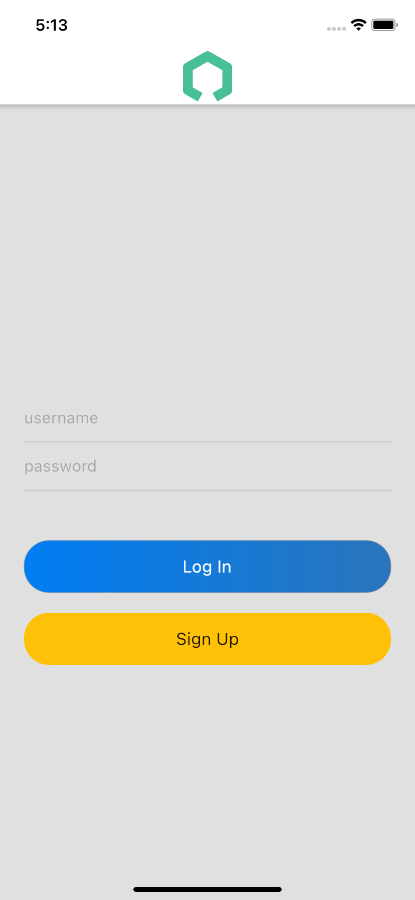
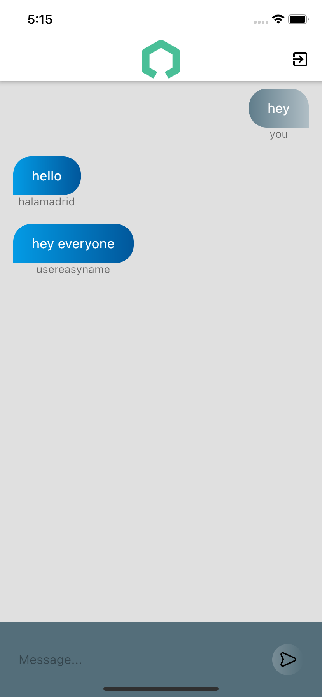

# Basic Chat App


          



## Current Implementation:

<li> <u>Front-end</u>: Flutter, some simulator (I used iOS 14.5 on iPhone 11)</li>
<li> <u>Back-end</u>: Python</li>
<li> <u>Database</u>: postgreSQL</li>
<li> <u>Protocol</u>: gRPC</li>
<br/><br/>
This is a very naive implementation of what is a chat room, much like Discord *LITE*.

## Database:
<li>
Main User Database (main_user_base): Stores all the users necessary info. The username is used as the primary key, although encryption using pythons hashlib library is implemented (originally also wanted to do this for tokens).
<li\>

<li>
Message Log Database (msg_log_base): Stores messages with sender and timestamps.
<li\>
<br/><br/>
The following are not yet implemented:
<li>
A dynamic online user database that stores users identified through their tokens.
<li\>
<li>
Chatroom databases which use the usernames of everyone in the group and stores the conversations separately.
<li\>

## Frontend:
<li> Basic client, uses shared preferences to store auth tokens to ensure user doesn't need to sign in every time they open the app.
<li\>
<br/>
Most are taken care of by the proto file.

## Usage

I have been debugging through VS code on an iOS simulator.

Run the server:

```
python server.py
```